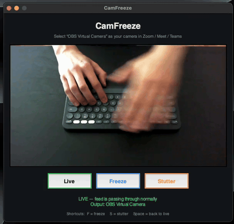

# CamFreeze

Freeze or stutter your webcam feed on demand, so it looks like your video
connection broke, handy when you need to slip out of a meeting.

How it works: CamFreeze reads your real webcam and republishes it as a
**virtual camera**. Your meeting app (Zoom, Meet, Teams, ...) uses the virtual
camera instead of the real one. When you hit **Freeze** the outgoing video
holds the last frame; **Stutter** makes it laggy and blocky like a bad
connection.

## Demo



## One-time setup

1. **Install [OBS Studio](https://obsproject.com/) v30 or newer.** macOS only
   allows virtual cameras through a signed system extension, and OBS provides
   one. You won't need to keep OBS running — it's just the driver.
2. Open OBS once, click **Start Virtual Camera** (bottom right), approve the
   system-extension prompt in System Settings if asked, then click **Stop
   Virtual Camera** and quit OBS.
3. Set up the Python environment (already done if `venv/` exists):

   ```bash
   python3 -m venv venv
   ./venv/bin/pip install -r requirements.txt
   ```

## Usage

```bash
./run.sh
```

(or `./venv/bin/python app.py`)

- Grant camera access when macOS asks.
- In Zoom / Meet / Teams, select **OBS Virtual Camera** as your camera.
- Buttons / shortcuts:
  - **Live** (`Space`) — normal passthrough
  - **Freeze** (`F`) — output sticks on the current frame
  - **Stutter** (`S`) — output becomes laggy and artifact-ridden
  - Pressing the active effect button again returns to live.

Keep CamFreeze running for the whole meeting (start it *before* joining). The
preview in the window shows exactly what others see (mirrored).

## Notes

- Only one app can own the OBS virtual camera at a time — don't run OBS's own
  virtual camera while CamFreeze is running.
- Audio is not affected.
